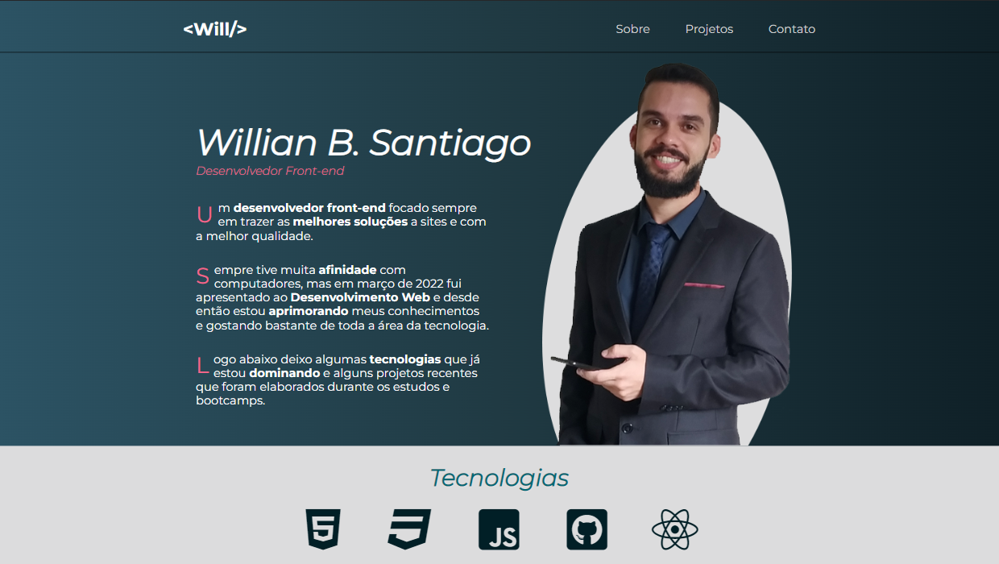

<code>PT_BR version</code>

<h1>Portfólio Profissional</h2>

Iniciei o desenvolvimento deste portfólio durante o curso de Responsive Web Design da plataforma freeCodeCamp e após finalizar o curso decidi investi nele e torná-lo meu portfólio principal.

Durante o desenvolvimento foi utilizado apenas HTML5 como linguagem de marcação e CSS3 como estilização, utilizando também CSS Media queries para tornar o site responsivo para todas as plataformas.

Futuramente haverão mais implementações conforme vou aprimorando meu aprendizado!! 😉

<code>ENG version</code>
<h1>Professional Portfolio</h1>

I started the development of this portfolio during the Responsive Web Design course on the freeCodeCamp platform and after finishing the course I decided to invest in it and make it my main portfolio.

During development, only HTML5 was used as a markup language and CSS3 as a style, also using CSS Media queries to make the site responsive for all platforms.

In the future there will be more implementations as I improve my learning!! 😉

